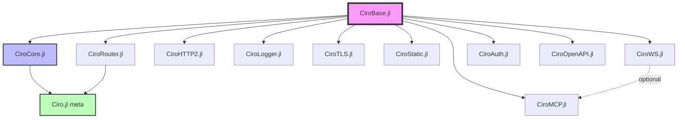

# Ciro.jl Ecosystem — Implementation Plan

> **Date:** 2026-05-22
> **Version:** 1.0
> **Target:** Production-ready, modular, AOT-compilable HTTP framework for Julia
> **Parallelism:** Designed for 4-6 agents working simultaneously

---

## Table of Contents

1. [Architecture Overview](#1-architecture-overview)
2. [Package Structure & Dependencies](#2-package-structure--dependencies)
3. [Phase 0: Monorepo Setup](#3-phase-0-monorepo-setup)
4. [Phase 1: CiroBase.jl — Interface Contracts](#4-phase-1-cirobasejl--interface-contracts)
5. [Phase 2: CiroCore.jl — Engine & Defaults](#5-phase-2-cirocorejl--engine--defaults)
6. [Phase 3: Ecosystem Packages (Parallel)](#6-phase-3-ecosystem-packages-parallel)
7. [Phase 4: Integration, Testing & Benchmarks](#7-phase-4-integration-testing--benchmarks)
8. [Phase 5: Documentation & Release](#8-phase-5-documentation--release)
9. [Interface Specifications](#9-interface-specifications)
10. [File-by-File Implementation Guide](#10-file-by-file-implementation-guide)
11. [Testing Strategy](#11-testing-strategy)
12. [AOT Compilation Checklist](#12-aot-compilation-checklist)
13. [Agent Assignment Matrix](#13-agent-assignment-matrix)

---

## 1. Architecture Overview

```
┌─────────────────────────────────────────────────────────────────┐
│                    USER APPLICATION                               │
│  server = CiroServer(router=MyRouter(), codec=HTTP11Codec())     │
│  start!(server)                                                  │
└─────────────────────────┬───────────────────────────────────────┘
                          │ uses
┌─────────────────────────▼───────────────────────────────────────┐
│                     Ciro.jl (meta-package)                        │
│  Re-exports: CiroBase + CiroCore + CiroRouter                   │
└──────┬──────────────────┬──────────────────────┬────────────────┘
       │                  │                      │
┌──────▼──────┐  ┌───────▼───────┐  ┌──────────▼──────────┐
│ CiroBase.jl │  │ CiroCore.jl   │  │ CiroRouter.jl       │
│ Interfaces  │  │ io_uring +    │  │ Compile-time radix   │
│ Types only  │  │ HTTP/1.1 +    │  │ trie + runtime       │
│ Zero deps   │  │ Buffer pools  │  │ fallback             │
└──────┬──────┘  └───────┬───────┘  └─────────────────────┘
       │                  │
       │         ┌────────┴─────────────────────────────┐
       │         │        ECOSYSTEM (optional)           │
       │         ├── CiroHTTP2.jl   (HTTP/2 + HPACK)    │
       │         ├── CiroLogger.jl  (Structured logging) │
       │         ├── CiroTLS.jl     (OpenSSL bindings)   │
       │         ├── CiroStatic.jl  (Static files, AOT)  │
       │         ├── CiroWS.jl      (WebSocket codec)    │
       │         ├── CiroAuth.jl    (JWT/OAuth middle.)  │
       │         ├── CiroMCP.jl     (MCP server proto)   │
       │         └── CiroOpenAPI.jl (Schema + docs)      │
       │
┌──────▼─────────────────────────────────────────────────┐
│              LINUX KERNEL (io_uring)                     │
└─────────────────────────────────────────────────────────┘
```

### Core Design Principles

1. **Zero-cost abstraction**: All component boundaries are erased at compile time via monomorphization
2. **Interface-driven**: `CiroBase.jl` defines contracts; implementations are separate packages
3. **AOT-first**: Every design decision must pass the `juliac --trim=safe` test
4. **No allocations in hot path**: Buffer pools, stack-allocated views, pre-serialized headers
5. **Minimal dependencies**: Core depends only on `PicoHTTPParser` (C parser) and stdlib

---

## 2. Package Structure & Dependencies

```
ciro-ecosystem/                    ← Monorepo during development
├── CiroBase/                      ← Phase 1
│   ├── Project.toml               deps: none
│   ├── src/
│   │   ├── CiroBase.jl
│   │   ├── abstract_types.jl      All abstract type declarations
│   │   ├── interfaces.jl          Interface documentation & checks
│   │   ├── request.jl             Request struct
│   │   ├── response.jl            Response struct + builders
│   │   ├── methods.jl             HTTP method constants
│   │   └── status.jl              Status codes + precomputed lines
│   └── test/
│       └── runtests.jl
│
├── CiroCore/                      ← Phase 2
│   ├── Project.toml               deps: CiroBase, PicoHTTPParser
│   ├── lib/
│   │   ├── ciro_uring.c           io_uring wrapper (refactored)
│   │   ├── ciro_uring.h           Public C API header
│   │   └── Makefile
│   ├── src/
│   │   ├── CiroCore.jl
│   │   ├── io_context.jl          IOContext struct + buffer pool
│   │   ├── connection.jl          Connection struct + pool
│   │   ├── codec_http11.jl        HTTP/1.1 codec (default)
│   │   ├── server.jl              CiroServer{} struct + start!/stop!
│   │   ├── worker.jl              Worker loop + event dispatch
│   │   ├── serializer.jl          Zero-alloc response serialization
│   │   ├── defaults.jl            NullLogger, NoTLS, NoRateLimit, etc.
│   │   └── compat.jl              Fallback server (non-Linux)
│   └── test/
│       ├── runtests.jl
│       ├── server_test.jl
│       ├── codec_test.jl
│       └── io_context_test.jl
│
├── CiroRouter/                    ← Phase 3 (Agent A)
│   ├── Project.toml               deps: CiroBase
│   ├── src/
│   │   ├── CiroRouter.jl
│   │   ├── radix_trie.jl          Compile-time trie generation
│   │   ├── runtime_router.jl      Runtime fallback (dynamic routes)
│   │   ├── route_macro.jl         @routes macro
│   │   ├── route_groups.jl        Group + scoped middleware
│   │   └── params.jl              Path parameter extraction
│   └── test/
│       ├── runtests.jl
│       ├── trie_test.jl
│       ├── macro_test.jl
│       └── params_test.jl
│
├── CiroHTTP2/                     ← Phase 3 (Agent B)
│   ├── Project.toml               deps: CiroBase
│   ├── src/
│   │   ├── CiroHTTP2.jl
│   │   ├── frames.jl              Frame parsing/encoding
│   │   ├── hpack.jl               HPACK compression
│   │   ├── streams.jl             Stream multiplexing
│   │   ├── flow_control.jl        Window management
│   │   └── codec.jl               AbstractCodec implementation
│   └── test/
│
├── CiroLogger/                    ← Phase 3 (Agent C)
│   ├── Project.toml               deps: CiroBase
│   ├── src/
│   │   ├── CiroLogger.jl
│   │   ├── structured.jl          JSON structured logging
│   │   ├── formatters.jl          Log formatters
│   │   └── sinks.jl               File, stdout, custom sinks
│   └── test/
│
├── CiroTLS/                       ← Phase 3 (Agent D)
│   ├── Project.toml               deps: CiroBase
│   ├── src/
│   │   ├── CiroTLS.jl
│   │   ├── openssl.jl             OpenSSL C bindings
│   │   ├── context.jl             TLS context management
│   │   └── handshake.jl           TLS handshake integration
│   └── test/
│
├── CiroStatic/                    ← Phase 3 (Agent E)
│   ├── Project.toml               deps: CiroBase
│   ├── src/
│   │   ├── CiroStatic.jl
│   │   ├── mime_types.jl           MIME type detection
│   │   ├── file_router.jl         AOT-friendly static router
│   │   ├── sendfile.jl            io_uring splice/sendfile
│   │   └── cache.jl               ETag + conditional requests
│   └── test/
│
├── CiroWS/                        ← Phase 3 (Agent F)
│   ├── Project.toml               deps: CiroBase
│   ├── src/
│   │   ├── CiroWS.jl
│   │   ├── handshake.jl           WebSocket upgrade
│   │   ├── frames.jl              Frame codec
│   │   └── connection.jl          WS connection management
│   └── test/
│
├── CiroAuth/                      ← Phase 4
│   ├── Project.toml               deps: CiroBase
│   └── src/
│       ├── CiroAuth.jl
│       ├── jwt.jl                  JWT verification
│       ├── oauth.jl                OAuth2 flows
│       └── middleware.jl           WithAuth{H} functor
│
├── CiroMCP/                       ← Phase 4
│   ├── Project.toml               deps: CiroBase, CiroWS (optional)
│   └── src/
│       ├── CiroMCP.jl
│       ├── protocol.jl            MCP message handling
│       ├── tools.jl               Tool registration
│       └── transport.jl           stdio/SSE/WS transports
│
├── CiroOpenAPI/                   ← Phase 4
│   ├── Project.toml               deps: CiroBase
│   └── src/
│       ├── CiroOpenAPI.jl
│       ├── schema.jl              Schema generation from types
│       ├── docs_ui.jl             Swagger UI serving
│       └── validation.jl          Request validation
│
└── Ciro/                          ← Meta-package (Phase 2)
    ├── Project.toml               deps: CiroBase, CiroCore, CiroRouter
    └── src/
        └── Ciro.jl                Re-exports everything
```

---

## 3. Phase 0: Monorepo Setup

**Duration**: 1 session
**Agent**: Any single agent
**Blocking**: All other phases

### Tasks

- [ ] Create monorepo directory structure
- [ ] Set up each sub-package with minimal `Project.toml`
- [ ] Configure `test/runtests.jl` for each package
- [ ] Create `Makefile` at root for building C library
- [ ] Set up CI configuration (GitHub Actions)
- [ ] Create `.JuliaFormatter.toml` for consistent style
- [ ] Add `dev` dependencies between local packages (using `path=`)

### Monorepo `Project.toml` (root — development workspace)

```toml
[workspace]
members = [
    "CiroBase",
    "CiroCore",
    "CiroRouter",
    "CiroHTTP2",
    "CiroLogger",
    "CiroTLS",
    "CiroStatic",
    "CiroWS",
    "Ciro",
]
```

---

## 4. Phase 1: CiroBase.jl — Interface Contracts

**Duration**: 1-2 sessions
**Agent**: Agent 1 (Core Architect)
**Blocking**: All Phase 2 and Phase 3 work
**Dependencies**: None

### 4.1 Abstract Types

```julia
# src/abstract_types.jl

"""Supertype for all HTTP request routers."""
abstract type AbstractRouter end

"""Supertype for all protocol codecs (HTTP/1.1, HTTP/2, etc.)."""
abstract type AbstractCodec end

"""Supertype for system-level loggers (not request loggers)."""
abstract type AbstractSystemLogger end

"""Supertype for error handlers that format error responses."""
abstract type AbstractErrorHandler end

"""Supertype for TLS/SSL context providers."""
abstract type AbstractTLSContext end

"""Supertype for server-level rate limiters."""
abstract type AbstractRateLimiter end

"""Supertype for I/O backends (io_uring, epoll, kqueue)."""
abstract type AbstractIOBackend end
```

### 4.2 Interface Contracts (Required Methods)

Each abstract type must define a clear set of methods that implementors MUST provide:

#### AbstractRouter
```julia
"""
    route(router::R, method::UInt8, path::AbstractString) -> Union{Nothing, handler}

Find a handler for the given method+path combination.
Returns `nothing` if no route matches.
The handler must be callable as `handler(request)::Response` or
`handler(request, params...)::Response` for parameterized routes.
"""
function route end

"""
    add_route!(router::R, method::UInt8, pattern::String, handler) -> R

Register a new route. May error if the router is compile-time only.
"""
function add_route! end
```

#### AbstractCodec
```julia
"""
    parse_request(codec::C, buffer::AbstractVector{UInt8}, nbytes::Int) -> Union{Nothing, Request}

Parse raw bytes into a Request. Returns nothing on parse failure.
Must be non-allocating for the common case.
"""
function parse_request end

"""
    encode_response(codec::C, response::Response, buffer::Vector{UInt8}) -> Int

Serialize a Response into the provided buffer. Returns bytes written.
Buffer must be pre-allocated with sufficient capacity.
"""
function encode_response end

"""
    negotiate_upgrade(codec::C, request::Request) -> Union{Nothing, AbstractCodec}

Check if the request wants to upgrade protocols (e.g., h2c, WebSocket).
Returns a new codec or nothing.
"""
function negotiate_upgrade end
```

#### AbstractSystemLogger
```julia
"""
    log_event(logger::L, level::LogLevel, msg::String; kwargs...)

Log a system event (startup, shutdown, errors). NOT per-request logging.
"""
function log_event end

@enum LogLevel DEBUG INFO WARN ERROR FATAL
```

#### AbstractErrorHandler
```julia
"""
    handle_error(handler::E, error::Exception, request::Union{Nothing,Request}) -> Response

Convert an exception into an HTTP Response.
"""
function handle_error end
```

#### AbstractTLSContext
```julia
"""
    tls_wrap_fd(ctx::T, fd::RawFD) -> TLSConnection

Wrap a raw file descriptor with TLS.
"""
function tls_wrap_fd end

"""
    tls_enabled(ctx::T) -> Bool

Returns true if TLS is active. Singleton `NoTLS` returns false.
"""
function tls_enabled end
```

#### AbstractRateLimiter
```julia
"""
    check_rate(limiter::RL, client_id::AbstractString) -> Bool

Returns true if the request should proceed, false if rate-limited.
"""
function check_rate end
```

### 4.3 Request & Response Types

```julia
# src/request.jl

"""
    Request

Immutable HTTP request. Fields are zero-copy views into the parse buffer.
"""
struct Request
    method      :: UInt8                          # Methods.GET, etc.
    path        :: StringView                     # Zero-copy view into buffer
    query       :: StringView                     # Query string (after ?)
    headers     :: Vector{Pair{StringView,StringView}}  # Header name→value
    body        :: SubArray{UInt8,1,Vector{UInt8},Tuple{UnitRange{Int}},true}
    params      :: Vector{Pair{Symbol,StringView}}  # Route parameters
    version     :: UInt8                          # 11 = HTTP/1.1, 20 = HTTP/2
end
```

```julia
# src/response.jl

"""
    Response

HTTP response with pre-computed header serialization.
"""
struct Response
    status  :: Int16
    headers :: Vector{Pair{String,String}}
    body    :: Vector{UInt8}
end

# Builder functions
@inline text(body::String; status::Int=200) = ...
@inline html(body::String; status::Int=200) = ...
@inline json(data; status::Int=200) = ...  # Requires JSON extension
@inline redirect(url::String; status::Int=302) = ...
@inline error_response(status::Int, message::String="") = ...
```

### 4.4 HTTP Method Constants

```julia
# src/methods.jl
module Methods
    const GET     = UInt8(1)
    const POST    = UInt8(2)
    const PUT     = UInt8(3)
    const DELETE  = UInt8(4)
    const PATCH   = UInt8(5)
    const HEAD    = UInt8(6)
    const OPTIONS = UInt8(7)
    const TRACE   = UInt8(8)
    const CONNECT = UInt8(9)
    const UNKNOWN = UInt8(0)

    @inline function from_string(m::AbstractString)::UInt8
        # Fast path using first byte + length
        ...
    end

    @inline function to_string(m::UInt8)::String
        # Lookup table
        ...
    end
end
```

### 4.5 Status Line Constants

```julia
# src/status.jl
# Pre-computed status lines for zero-allocation serialization
const STATUS_LINES = Dict{Int16, String}(
    200 => "HTTP/1.1 200 OK\r\n",
    201 => "HTTP/1.1 201 Created\r\n",
    204 => "HTTP/1.1 204 No Content\r\n",
    # ... all common codes
)

@inline status_line(code::Int)::String = get(STATUS_LINES, Int16(code), _generic_status(code))
```

### 4.6 Deliverables Checklist

- [ ] `CiroBase/src/CiroBase.jl` — Module definition + exports
- [ ] `CiroBase/src/abstract_types.jl` — All 6+ abstract types
- [ ] `CiroBase/src/interfaces.jl` — Method signatures + docstrings + check functions
- [ ] `CiroBase/src/request.jl` — Request struct
- [ ] `CiroBase/src/response.jl` — Response struct + builders
- [ ] `CiroBase/src/methods.jl` — HTTP method constants
- [ ] `CiroBase/src/status.jl` — Status line constants
- [ ] `CiroBase/test/runtests.jl` — Type stability tests, interface validation tests
- [ ] `CiroBase/Project.toml` — Deps: StringViews only

---

## 5. Phase 2: CiroCore.jl — Engine & Defaults

**Duration**: 3-4 sessions
**Agent**: Agent 1 (Core Architect) + Agent 2 (Systems/C)
**Dependencies**: Phase 1 complete

### 5.1 C Library (Agent 2)

Refactor existing `lib/ciro.c` into a clean, documented C library:

```c
// lib/ciro_uring.h — Public API

typedef struct ciro_engine ciro_engine_t;
typedef struct ciro_connection ciro_connection_t;

// Engine lifecycle
ciro_engine_t* ciro_engine_new(int port, int queue_depth, int flags);
void           ciro_engine_destroy(ciro_engine_t* engine);
int            ciro_engine_fd(ciro_engine_t* engine);

// Event loop
int            ciro_submit(ciro_engine_t* engine);
int            ciro_wait_batch(ciro_engine_t* engine, ciro_completion_t* out, int max, int timeout_ms);

// Operations
void           ciro_queue_accept(ciro_engine_t* engine);
void           ciro_queue_read(ciro_engine_t* engine, int fd, void* buf, int len);
void           ciro_queue_write(ciro_engine_t* engine, int fd, const void* buf, int len);
void           ciro_queue_close(ciro_engine_t* engine, int fd);
void           ciro_queue_timeout(ciro_engine_t* engine, int timeout_ms);

// Buffer ring (io_uring provided buffers)
int            ciro_register_buffers(ciro_engine_t* engine, int count, int buf_size);
void           ciro_return_buffer(ciro_engine_t* engine, int buf_id);

// Socket options
void           ciro_configure_socket(int fd);  // TCP_NODELAY, etc.
```

**Implementation details:**
- Use `IORING_FEAT_FAST_POLL` for optimal accept
- Use `IORING_OP_PROVIDE_BUFFERS` for kernel-managed buffer ring
- `SO_REUSEPORT` for multi-threaded accept
- Signal-safe: Block `SIGUSR2` (Julia GC) during `io_uring_wait_cqe`
- Compile with: `gcc -O3 -march=native -shared -fPIC -o libciro_uring.so ciro_uring.c -luring`

### 5.2 IOContext (Agent 1)

```julia
# src/io_context.jl

mutable struct IOContext
    engine_ptr   :: Ptr{Cvoid}            # Pointer to C engine_state
    const buffers :: Vector{Vector{UInt8}}  # Julia-side buffer pool
    const conns   :: Vector{Connection}     # Connection pool
    state         :: Atomic{UInt8}         # 0=stopped, 1=starting, 2=running, 3=stopping
end

struct Connection
    fd           :: Cint
    state        :: UInt8   # 0=idle, 1=reading, 2=writing, 3=upgrading
    read_buf_id  :: Int32   # Buffer ring buffer ID (-1 if none)
    write_pending :: Union{Nothing, Vector{UInt8}}
    close_after  :: Bool
end
```

### 5.3 CiroServer Struct (Agent 1)

```julia
# src/server.jl

"""
    CiroServer{R,C,SL,E,T,RL}

High-performance HTTP server with swappable components.
All type parameters are resolved at construction time —
the compiler generates specialized code for each configuration.
"""
struct CiroServer{
    R  <: AbstractRouter,
    C  <: AbstractCodec,
    SL <: AbstractSystemLogger,
    E  <: AbstractErrorHandler,
    T  <: AbstractTLSContext,
    RL <: AbstractRateLimiter,
}
    # ── Swappable components ──
    router        :: R
    codec         :: C
    system_logger :: SL
    error_handler :: E
    tls           :: T
    rate_limiter  :: RL

    # ── Configuration ──
    host          :: String
    port          :: Int
    backlog       :: Int
    read_timeout  :: UInt32
    write_timeout :: UInt32
    max_body_size :: UInt64

    # ── Internal (not swappable) ──
    _ctx          :: IOContext
end

# Keyword constructor — users never see type parameters
function CiroServer(;
    router        = nothing,  # Must be provided or error
    codec         = HTTP11Codec(),
    system_logger = NullSystemLogger(),
    error_handler = DefaultErrorHandler(),
    tls           = NoTLS(),
    rate_limiter  = NoRateLimit(),
    host          = "0.0.0.0",
    port          = 8080,
    backlog       = 8192,
    read_timeout  = UInt32(30000),
    write_timeout = UInt32(30000),
    max_body_size = UInt64(1_048_576),
)
    router === nothing && error("CiroServer requires a `router` argument")
    ctx = IOContext()  # Initialized on start!
    return CiroServer(
        router, codec, system_logger, error_handler, tls, rate_limiter,
        host, port, backlog, read_timeout, write_timeout, max_body_size,
        ctx
    )
end
```

### 5.4 Default Implementations

```julia
# src/defaults.jl

# ── NullSystemLogger (zero-cost, compiles away) ──
struct NullSystemLogger <: AbstractSystemLogger end
@inline log_event(::NullSystemLogger, ::LogLevel, ::String; kwargs...) = nothing

# ── NoTLS (zero-cost) ──
struct NoTLS <: AbstractTLSContext end
@inline tls_enabled(::NoTLS) = false
@inline tls_wrap_fd(::NoTLS, fd) = fd  # passthrough

# ── NoRateLimit (zero-cost) ──
struct NoRateLimit <: AbstractRateLimiter end
@inline check_rate(::NoRateLimit, ::AbstractString) = true

# ── DefaultErrorHandler ──
struct DefaultErrorHandler <: AbstractErrorHandler end
function handle_error(::DefaultErrorHandler, err::Exception, req::Union{Nothing,Request})
    status = err isa MethodError ? 405 :
             err isa BoundsError ? 404 : 500
    # Never expose internal error details to client (OWASP)
    return error_response(status, status == 500 ? "Internal Server Error" : string(err))
end
```

### 5.5 HTTP/1.1 Codec

```julia
# src/codec_http11.jl

struct HTTP11Codec <: AbstractCodec
    max_headers :: Int
end
HTTP11Codec(; max_headers=64) = HTTP11Codec(max_headers)

function parse_request(codec::HTTP11Codec, buffer::AbstractVector{UInt8}, nbytes::Int)
    # Delegate to PicoHTTPParser (C-based, ~2GB/s throughput)
    return PicoHTTPParser.parse_request(view(buffer, 1:nbytes))
end

function encode_response(codec::HTTP11Codec, response::Response, buffer::Vector{UInt8})
    cursor = 1
    # Status line (from precomputed constants)
    cursor = write_status_line!(buffer, cursor, response.status)
    # Headers
    for (k, v) in response.headers
        cursor = write_header!(buffer, cursor, k, v)
    end
    # Content-Length (if not chunked)
    cursor = write_content_length!(buffer, cursor, length(response.body))
    # CRLF separator
    cursor = write_crlf!(buffer, cursor)
    # Body
    cursor = write_body!(buffer, cursor, response.body)
    return cursor - 1  # bytes written
end
```

### 5.6 Worker Loop

```julia
# src/worker.jl

function worker_loop(server::CiroServer, thread_id::Int)
    ctx = server._ctx
    engine = ctx.engine_ptr
    completions = Vector{CiroCompletion}(undef, 64)  # Batch buffer

    while ctx.state[] == UInt8(2)  # RUNNING
        n = ciro_wait_batch(engine, completions, 64, 10)
        n <= 0 && (yield(); continue)

        for i in 1:n
            handle_completion(server, completions[i])
        end

        ciro_submit(engine)
    end
end

@inline function handle_completion(server::CiroServer, completion)
    op = completion.op_type
    if op == OP_ACCEPT
        handle_accept(server, completion)
    elseif op == OP_READ
        handle_read(server, completion)
    elseif op == OP_WRITE
        handle_write(server, completion)
    end
end

function handle_read(server::CiroServer, completion)
    fd = completion.fd
    nbytes = completion.result
    nbytes <= 0 && return close_connection(server, fd)

    buffer = completion.buffer

    # Parse via codec (monomorphized — zero virtual dispatch)
    request = parse_request(server.codec, buffer, nbytes)
    request === nothing && return send_error(server, fd, 400)

    # Rate limit check (compiles to nothing for NoRateLimit)
    if !check_rate(server.rate_limiter, get_client_ip(fd))
        return send_error(server, fd, 429)
    end

    # Route dispatch (monomorphized for concrete router type)
    response = try
        route(server.router, request.method, request.path)
    catch err
        handle_error(server.error_handler, err, request)
    end

    # Encode response via codec
    out_buf = get_buffer(server._ctx)
    nbytes_out = encode_response(server.codec, response, out_buf)

    # Queue write via io_uring
    queue_write(server, fd, out_buf, nbytes_out)
end
```

### 5.7 Deliverables Checklist

- [ ] `CiroCore/lib/ciro_uring.c` — Refactored C library
- [ ] `CiroCore/lib/ciro_uring.h` — Public C API
- [ ] `CiroCore/lib/Makefile` — Build script
- [ ] `CiroCore/src/CiroCore.jl` — Module + exports
- [ ] `CiroCore/src/io_context.jl` — IOContext + buffer pool
- [ ] `CiroCore/src/connection.jl` — Connection struct
- [ ] `CiroCore/src/codec_http11.jl` — HTTP/1.1 codec
- [ ] `CiroCore/src/server.jl` — CiroServer struct + constructor
- [ ] `CiroCore/src/worker.jl` — Worker event loop
- [ ] `CiroCore/src/serializer.jl` — Zero-alloc response encoding
- [ ] `CiroCore/src/defaults.jl` — NullLogger, NoTLS, NoRateLimit, DefaultErrorHandler
- [ ] `CiroCore/src/compat.jl` — Fallback server (non-Linux)
- [ ] `CiroCore/src/lifecycle.jl` — start!/stop!/restart! functions
- [ ] `CiroCore/test/runtests.jl` — Unit tests
- [ ] `CiroCore/test/integration_test.jl` — Full request/response cycle

---

## 6. Phase 3: Ecosystem Packages (Parallel)

**Duration**: 2-3 sessions
**Agents**: 4-6 agents working in parallel
**Dependencies**: Phase 1 complete (CiroBase interfaces defined)

Each agent can work independently because they only depend on `CiroBase.jl` interfaces.

### 6.1 CiroRouter.jl (Agent A)

**Goal**: Compile-time radix trie router with runtime fallback.

#### Key Design Decisions:
- `@routes` macro generates a dispatch function at compile time
- Route groups with scoped middleware
- Parameter extraction with zero-copy `StringView`
- Wildcard/catch-all support
- Optional runtime router for dynamic route registration

#### API Surface:
```julia
# Compile-time (AOT-friendly)
@routes MyApp begin
    middleware(Logger, CORS)

    group("/api"; middleware=[WithAuth]) do
        get("/users",       list_users)
        get("/users/:id",   get_user)
        post("/users",      create_user)
        put("/users/:id",   update_user)
        delete("/users/:id", delete_user)
    end

    group("/public") do
        get("/health", health_check)
        get("/docs",   serve_docs)
    end
end

# Runtime fallback
router = RuntimeRouter()
add_route!(router, Methods.GET, "/dynamic/:id", my_handler)
```

#### Implementation Notes:
- Reuse existing `@routes` macro logic from current `router.jl`
- Add `group()` syntax for route grouping
- Implement `AbstractRouter` interface from CiroBase
- Must pass type-stability tests (no `Any` in hot paths)

### 6.2 CiroHTTP2.jl (Agent B)

**Goal**: Full HTTP/2 codec implementing `AbstractCodec`.

#### Key Components:
- HPACK header compression (static + dynamic tables)
- Frame parser/encoder (all 10 frame types)
- Stream multiplexing state machine
- Flow control (connection + stream level)
- Server push support
- h2c upgrade from HTTP/1.1

#### API Surface:
```julia
codec = HTTP2Codec(;
    max_concurrent_streams = 100,
    initial_window_size = 65535,
    max_frame_size = 16384,
    max_header_list_size = 8192,
)

# Implements AbstractCodec interface
parse_request(codec, buffer, nbytes)
encode_response(codec, response, buffer)
negotiate_upgrade(codec, request)
```

### 6.3 CiroLogger.jl (Agent C)

**Goal**: Structured, high-performance logging implementing `AbstractSystemLogger`.

#### Key Design:
- JSON-structured output by default
- Async log sink (Channel-based, non-blocking)
- Multiple output targets (stdout, file, custom sinks)
- Request-scoped logging via ScopedValues
- Log levels: DEBUG, INFO, WARN, ERROR, FATAL
- Sampling for high-throughput scenarios

#### API Surface:
```julia
logger = StructuredLogger(;
    sink = FileSink("/var/log/ciro.log"),
    level = INFO,
    format = JSONFormat(),
    sample_rate = 1.0,  # Log 100% of requests
)

# As middleware (request-level logging):
struct RequestLogger{H}
    handler :: H
    logger  :: StructuredLogger
end
@inline (m::RequestLogger)(req) = ...
```

### 6.4 CiroTLS.jl (Agent D)

**Goal**: OpenSSL-based TLS implementing `AbstractTLSContext`.

#### Key Components:
- OpenSSL context management (SSL_CTX)
- Certificate loading + validation
- TLS 1.2 and 1.3 support
- ALPN negotiation (for h2)
- Session resumption
- Integration with io_uring (TLS after accept)

#### API Surface:
```julia
tls = OpenSSLContext(
    certfile = "/path/to/cert.pem",
    keyfile  = "/path/to/key.pem",
    protocols = [:tls12, :tls13],
    alpn = ["h2", "http/1.1"],
)
```

### 6.5 CiroStatic.jl (Agent E)

**Goal**: AOT-friendly static file serving with io_uring splice.

#### Key Design:
- Pre-scan directory at compile time → generate dispatch table
- MIME type detection via extension mapping
- ETag generation + conditional request support (304)
- `io_uring` splice for zero-copy file serving
- Gzip/Brotli pre-compression support
- SPA fallback mode

#### API Surface:
```julia
# AOT-friendly: files known at compile time
static = StaticRouter("/var/www/public";
    index = "index.html",
    spa_fallback = true,
    precompress = [:gzip, :br],
    cache_control = "public, max-age=86400",
)

# Implements AbstractRouter
route(static, method, path)
```

### 6.6 CiroWS.jl (Agent F)

**Goal**: WebSocket codec with connection management.

#### Key Components:
- RFC 6455 handshake (upgrade from HTTP/1.1)
- Frame encode/decode (text, binary, ping, pong, close)
- Message fragmentation
- Per-message compression (RFC 7692)
- Connection state machine
- Broadcast / room management utilities

#### API Surface:
```julia
# Upgrade handler
ws_handler = WebSocketHandler(;
    on_connect = (ws) -> println("Connected"),
    on_message = (ws, msg) -> ws_send(ws, "Echo: $msg"),
    on_close   = (ws, code, reason) -> nothing,
    max_frame_size = 1_048_576,
)

# Integration with router
@routes App begin
    get("/ws", ws_handler)  # Auto-detects upgrade
end
```

---

## 7. Phase 4: Integration, Testing & Benchmarks

**Duration**: 2 sessions
**Agents**: All agents converge
**Dependencies**: Phase 2 + Phase 3 complete

### 7.1 Integration Tests

```julia
# test/integration/full_stack_test.jl

using CiroBase, CiroCore, CiroRouter

# Build a complete server with all components
@routes TestApp begin
    get("/", req -> text("Hello"))
    get("/json", req -> json(Dict("ok" => true)))
    post("/echo", req -> text(String(req.body)))
    get("/user/:id", (req, id) -> json(Dict("id" => id)))
end

server = CiroServer(
    router = TestApp(),
    codec = HTTP11Codec(),
    port = 9999,
)

# Spawn server, run HTTP client tests, verify responses
```

### 7.2 Benchmarks

Create benchmarks comparing:
1. **Ciro ecosystem** vs current monolithic Ciro
2. **Ciro** vs HTTP.jl, Oxygen.jl
3. **Ciro** vs external (Rust/actix-web, Go/fasthttp)

Benchmark dimensions:
- Requests/second (plaintext)
- Latency p50/p99/p999
- Memory usage under load
- Connection scaling (1K, 10K, 100K concurrent)
- JSON serialization throughput

Tool: `wrk2` with fixed-rate workloads

### 7.3 AOT Compilation Test

```julia
# test/aot/compiled_server.jl
# This file must compile with: juliac --trim=safe compiled_server.jl

using Ciro

@routes App begin
    get("/", req -> text("Hello from AOT"))
    get("/health", req -> json(Dict("status" => "ok")))
end

function main(args)
    server = CiroServer(router=App(), port=8080)
    start!(server)
end

@main  # Julia 1.12+ entry point
```

**Verification**:
```bash
juliac --trim=safe --output-exe=ciro_server test/aot/compiled_server.jl
./ciro_server  # Must start and serve requests
```

---

## 8. Phase 5: Documentation & Release

**Duration**: 1-2 sessions
**Agent**: Documentation agent

### 8.1 Documentation Structure

```
docs/
├── src/
│   ├── index.md           # Landing page
│   ├── quickstart.md      # 5-minute getting started
│   ├── guide/
│   │   ├── routing.md     # Router guide
│   │   ├── middleware.md  # Middleware patterns
│   │   ├── static.md     # Static file serving
│   │   ├── websockets.md # WebSocket guide
│   │   ├── tls.md        # HTTPS setup
│   │   ├── http2.md      # HTTP/2 guide
│   │   ├── aot.md        # AOT compilation guide
│   │   └── mcp.md        # MCP server guide
│   ├── api/
│   │   ├── cirobase.md
│   │   ├── cirocore.md
│   │   └── ...
│   └── advanced/
│       ├── custom_router.md     # How to write a custom router
│       ├── custom_codec.md      # How to write a codec
│       ├── custom_middleware.md  # Middleware authoring
│       ├── performance.md       # Performance tuning
│       └── internals.md         # Architecture deep-dive
```

### 8.2 Examples

```
examples/
├── hello_world.jl         # Minimal server
├── rest_api.jl            # Full REST API
├── static_site.jl         # Static file serving
├── websocket_chat.jl      # WebSocket example
├── mcp_server.jl          # MCP protocol server
├── auth_api.jl            # JWT authentication
├── compiled_binary.jl     # AOT compilation example
└── full_app/              # Complete application
    ├── Project.toml
    ├── src/
    ├── static/
    └── test/
```

---

## 9. Interface Specifications

### 9.1 Middleware Functor Pattern

All middleware must follow this pattern for type stability and AOT compatibility:

```julia
"""
Middleware is a callable struct that wraps a handler.
The type parameter H captures the concrete handler type,
enabling full monomorphization of the middleware chain.
"""
struct MyMiddleware{H}
    handler :: H
    # ... middleware config fields ...
end

# The middleware is callable — processes request and delegates
@inline function (m::MyMiddleware)(req::Request)::Response
    # Pre-processing
    # ...
    response = m.handler(req)  # Call next handler (type-stable!)
    # Post-processing
    # ...
    return response
end
```

**Composition example:**
```julia
# This entire chain is a SINGLE concrete type:
handler = WithCORS(WithAuth(WithLogger(my_endpoint)))
# Type: WithCORS{WithAuth{WithLogger{typeof(my_endpoint)}}}
# Compiler inlines everything → zero overhead
```

### 9.2 Lifecycle Hooks

Instead of `Vector{Function}` (type-unstable), use a startup/shutdown protocol:

```julia
# Option A: Method overloading (simplest, AOT-friendly)
function on_startup(server::CiroServer)
    # Default: no-op
end

function on_shutdown(server::CiroServer)
    # Default: no-op
end

# Users override with their server type via a wrapper:
struct MyServer
    inner :: CiroServer{...}
end
on_startup(s::MyServer) = println("Starting up!")

# Option B: Tuple of functions (type-stable)
struct Hooks{S<:Tuple, P<:Tuple}
    startup  :: S  # Tuple of callable objects
    shutdown :: P
end

# Construction:
hooks = Hooks(
    (print_banner, init_db_pool),    # startup hooks
    (close_db_pool, flush_logs),     # shutdown hooks
)
```

### 9.3 Configuration Validation

```julia
function validate_config(server::CiroServer)
    server.port in 1:65535 || error("Invalid port: $(server.port)")
    server.backlog > 0 || error("Backlog must be positive")
    server.max_body_size > 0 || error("max_body_size must be positive")

    # Check interface compliance at construction time
    R = typeof(server.router)
    hasmethod(route, Tuple{R, UInt8, AbstractString}) ||
        error("Router $(R) must implement `route(router, method, path)`")

    return true
end
```

---

## 10. File-by-File Implementation Guide

### CiroBase.jl — Complete File Listing

| File | Lines (est.) | Complexity | Description |
|------|-------------|------------|-------------|
| `src/CiroBase.jl` | 30 | Low | Module + includes + exports |
| `src/abstract_types.jl` | 40 | Low | Abstract type declarations |
| `src/interfaces.jl` | 120 | Medium | Method signatures + docs + checks |
| `src/methods.jl` | 50 | Low | HTTP method constants |
| `src/status.jl` | 80 | Low | Status codes + pre-computed lines |
| `src/request.jl` | 60 | Medium | Request struct + accessors |
| `src/response.jl` | 100 | Medium | Response struct + builders |
| `test/runtests.jl` | 80 | Low | Type stability + interface tests |

### CiroCore.jl — Complete File Listing

| File | Lines (est.) | Complexity | Description |
|------|-------------|------------|-------------|
| `src/CiroCore.jl` | 40 | Low | Module + includes + exports |
| `src/io_context.jl` | 150 | High | Buffer pool + ring management |
| `src/connection.jl` | 100 | Medium | Connection struct + pool |
| `src/codec_http11.jl` | 200 | High | Full HTTP/1.1 implementation |
| `src/server.jl` | 150 | High | CiroServer struct + constructor |
| `src/worker.jl` | 200 | High | Event loop + dispatch |
| `src/serializer.jl` | 150 | High | Zero-alloc serialization |
| `src/defaults.jl` | 60 | Low | Null/No-op implementations |
| `src/compat.jl` | 100 | Medium | Fallback for non-Linux |
| `src/lifecycle.jl` | 80 | Medium | start!/stop!/restart! |
| `lib/ciro_uring.c` | 400 | High | io_uring C wrapper |
| `lib/ciro_uring.h` | 60 | Low | C header |
| `lib/Makefile` | 20 | Low | Build script |

### CiroRouter.jl — Complete File Listing

| File | Lines (est.) | Complexity | Description |
|------|-------------|------------|-------------|
| `src/CiroRouter.jl` | 30 | Low | Module + exports |
| `src/radix_trie.jl` | 200 | High | Compile-time trie + codegen |
| `src/runtime_router.jl` | 150 | Medium | Dynamic route table |
| `src/route_macro.jl` | 250 | High | @routes macro |
| `src/route_groups.jl` | 100 | Medium | Group + middleware scoping |
| `src/params.jl` | 80 | Medium | Parameter extraction |

---

## 11. Testing Strategy

### 11.1 Unit Test Requirements

Every package must have:
- **Type stability tests**: `@inferred` on all hot-path functions
- **Interface compliance tests**: Verify all required methods exist
- **Edge case tests**: Empty inputs, maximum sizes, malformed data
- **Allocation tests**: `@allocated` checks on hot paths (must be 0)

```julia
# Example: Type stability test
@testset "HTTP11Codec type stability" begin
    codec = HTTP11Codec()
    buf = Vector{UInt8}("GET / HTTP/1.1\r\nHost: localhost\r\n\r\n")
    @test @inferred(parse_request(codec, buf, length(buf))) isa Union{Nothing, Request}
end

# Example: Zero allocation test
@testset "Response serialization allocations" begin
    codec = HTTP11Codec()
    resp = text("Hello")
    out_buf = Vector{UInt8}(undef, 4096)
    # Warm up
    encode_response(codec, resp, out_buf)
    # Measure
    allocs = @allocated encode_response(codec, resp, out_buf)
    @test allocs == 0
end
```

### 11.2 Integration Test Matrix

| Test Scenario | Components Involved | Priority |
|---------------|-------------------|----------|
| GET plaintext | Core + Router | P0 |
| POST with body | Core + Router + Body parsing | P0 |
| Route params | Router + Core | P0 |
| 404 handling | Router + ErrorHandler | P0 |
| Keep-alive | Core (connection reuse) | P1 |
| Middleware chain | Router + Core | P1 |
| Large body | Core (streaming) | P1 |
| WebSocket upgrade | Core + WS | P2 |
| HTTP/2 | Core + HTTP2 codec | P2 |
| TLS | Core + TLS | P2 |
| Static files | Core + Static | P2 |
| Rate limiting | Core + RateLimiter | P3 |
| AOT binary | All | P1 |

### 11.3 Performance Regression Tests

```julia
# benchmark/regression.jl
# Run after every PR — must not regress more than 5%

using BenchmarkTools

@benchmark begin
    # Parse 10000 HTTP requests
    for _ in 1:10000
        parse_request(codec, sample_request, length(sample_request))
    end
end

@benchmark begin
    # Route 10000 paths
    for path in sample_paths
        route(router, Methods.GET, path)
    end
end

@benchmark begin
    # Serialize 10000 responses
    for _ in 1:10000
        encode_response(codec, sample_response, buffer)
    end
end
```

---

## 12. AOT Compilation Checklist

Every component MUST pass these checks to be AOT-compatible:

### 12.1 Forbidden Patterns

- [ ] **No `eval()` at runtime** — All metaprogramming must resolve at compile time
- [ ] **No `invokelatest()`** — All dispatch must be statically resolvable
- [ ] **No `Vector{Function}`** — Use typed tuples or FunctionWrappers
- [ ] **No `Dict{Symbol, Any}` for extensibility** — Use parametric types
- [ ] **No runtime `include()`** — All code loaded at compile time
- [ ] **No `Ref{Any}` globals** — Use typed `Ref{T}` or `Atomic{T}`
- [ ] **No dynamic library loading** — Use `const` paths for `ccall`

### 12.2 Required Patterns

- [x] All type parameters resolved to concrete types at construction
- [x] All method signatures have concrete argument types in hot paths
- [x] Singleton no-ops (NoTLS, NullLogger) are zero-size structs
- [x] Response builders return concrete `Response` type
- [x] Router dispatch returns concrete handler type (via macro codegen)
- [x] C library path is a `const` global

### 12.3 Verification Script

```bash
#!/bin/bash
# scripts/verify_aot.sh

# Create minimal AOT test
cat > /tmp/ciro_aot_test.jl << 'EOF'
using Ciro

@routes App begin
    get("/", req -> text("Hello"))
end

function main(args)
    server = CiroServer(router=App(), port=8080)
    # Don't actually start — just verify compilation
    println("AOT OK")
end

@main
EOF

# Attempt compilation
juliac --trim=safe --output-exe=/tmp/ciro_test /tmp/ciro_aot_test.jl

# Verify
if [ $? -eq 0 ]; then
    echo "✅ AOT compilation successful"
    /tmp/ciro_test
else
    echo "❌ AOT compilation FAILED"
    exit 1
fi
```

---

## 13. Agent Assignment Matrix

### Phase 1 (Sequential — Blocks Everything)

| Agent | Task | Duration | Output |
|-------|------|----------|--------|
| Agent 1 | CiroBase.jl — all files | 1 session | Complete interface package |

### Phase 2 (Two agents in parallel)

| Agent | Task | Duration | Output |
|-------|------|----------|--------|
| Agent 1 | CiroCore.jl — Julia side | 2 sessions | Server struct, worker, codec |
| Agent 2 | CiroCore.jl — C library | 2 sessions | libciro_uring.so |

### Phase 3 (All agents in parallel — INDEPENDENT)

| Agent | Package | Duration | Dependencies |
|-------|---------|----------|--------------|
| Agent A | CiroRouter.jl | 2 sessions | CiroBase only |
| Agent B | CiroHTTP2.jl | 3 sessions | CiroBase only |
| Agent C | CiroLogger.jl | 1 session | CiroBase only |
| Agent D | CiroTLS.jl | 2 sessions | CiroBase only |
| Agent E | CiroStatic.jl | 1 session | CiroBase only |
| Agent F | CiroWS.jl | 2 sessions | CiroBase only |

### Phase 4 (Integration — All agents converge)

| Agent | Task | Duration |
|-------|------|----------|
| All | Integration testing | 1 session |
| Agent 1 | AOT verification | 1 session |
| Agent 2 | Benchmark suite | 1 session |
| Agent C | CiroMCP.jl | 1 session |
| Agent D | CiroAuth.jl | 1 session |
| Agent E | CiroOpenAPI.jl | 1 session |

### Phase 5 (Documentation)

| Agent | Task | Duration |
|-------|------|----------|
| Any | Documenter.jl setup + guides | 1 session |
| Any | Examples | 1 session |

---

## Appendix A: Migration from Current Monolithic Ciro.jl

The current codebase maps to the new ecosystem as follows:

| Current File | → New Location | Notes |
|---|---|---|
| `src/types.jl` | `CiroBase/src/request.jl`, `response.jl`, `methods.jl` | Split into focused files |
| `src/router.jl` | `CiroRouter/src/` | Extract macro + trie logic |
| `src/server.jl` | `CiroCore/src/server.jl`, `worker.jl` | Refactor into struct |
| `src/middleware.jl` | Individual middleware packages or `CiroCore/src/middleware/` | Functor pattern |
| `src/websocket.jl` | `CiroWS/src/` | Independent package |
| `src/h2.jl` | `CiroHTTP2/src/` | Independent package |
| `src/tls.jl` | `CiroTLS/src/` | Independent package |
| `src/static_files.jl` | `CiroStatic/src/` | Independent package |
| `src/cluster.jl` | `CiroCore/src/cluster.jl` | Stays in core |
| `src/compat.jl` | `CiroCore/src/compat.jl` | Stays in core |
| `lib/ciro.c` | `CiroCore/lib/ciro_uring.c` | Refactored API |

---

## Appendix B: Dependency Graph



---

## Appendix C: Version Strategy

| Package | Initial Version | Stability |
|---------|----------------|-----------|
| CiroBase.jl | 1.0.0 | Stable — MUST NOT break |
| CiroCore.jl | 0.1.0 | Pre-release until benchmarks pass |
| CiroRouter.jl | 0.1.0 | Pre-release |
| All ecosystem | 0.1.0 | Pre-release |
| Ciro.jl (meta) | 1.0.0 | When Core + Router are 1.0 |

**Semver rules:**
- `CiroBase.jl` is the "constitution" — breaking changes require major version bump across ALL packages
- Ecosystem packages can iterate independently
- `Ciro.jl` meta-package pins compatible version ranges

---

## Appendix D: Quick Reference — User-Facing API

```julia
# Minimal server (5 lines)
using Ciro

@routes App begin
    get("/", req -> text("Hello, World!"))
end

start!(CiroServer(router=App()))
```

```julia
# Full-featured server
using Ciro, CiroLogger, CiroTLS, CiroAuth

@routes API begin
    middleware(RequestLogger, WithCORS)

    group("/api/v1"; middleware=[WithAuth{:bearer}]) do
        get("/users",     list_users)
        post("/users",    create_user)
        get("/users/:id", get_user)
    end

    get("/health", req -> json(Dict("status" => "ok")))
end

server = CiroServer(
    router = API(),
    system_logger = StructuredLogger(sink=StdoutSink()),
    tls = OpenSSLContext("cert.pem", "key.pem"),
    port = 443,
)

start!(server)
```

```julia
# AOT-compiled binary
using Ciro

@routes App begin
    get("/", req -> text("Compiled!"))
end

function main(args)
    start!(CiroServer(router=App(), port=parse(Int, get(args, 1, "8080"))))
end

@main
```
